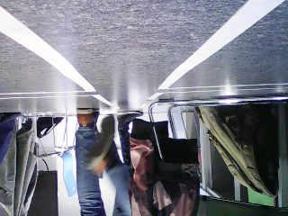

# Introduction

# Problem statement

The following is the original project description (translated to English):

> I would like to bring to market a vehicle that can drive independently from A
> to B. The vehicle must take into account traffic rules, road signs, traffic
> lights, etc. Research is being conducted using a small cart, the Pololu Zumo
> 32U4, on which a camera module Nicla Vision is mounted. The aim is to
> investigate the most appropriate method of recognizing the road, traffic
> signs and traffic lights. This should be demonstrated with a proof of
> concept. The cart does not need to drive fast, so the image processing does
> not need to be very fast. Assume one frame per second (or faster).

# Specifications

# Architecture

# Research

## Detecting lines

The Zumo robot needs to drive in a road map-like environment where it needs to act like a car. With the nicla vision camera, there needs to be a way for detecting lines in every frame to make the Zumo robot ride between the lines. Read lines from an image there are different algorithms to make it work. We need to make sure that it works on the OpenMV program if we only choose this one. In this research, two techniques are researched: convolution-based and feature-based. 

### Different line detection algorithms. 

#### Hough Transform 

This is a popular algorithm used to detect straight lines in an image. It works by transforming the image from Cartesian space to Hough space, where lines are represented as points. The algorithm then looks for clusters of points in Hough space, which correspond to lines in Cartesian space. 

For more information about Hough Transform algorithms check the below links: 

- [Wiki hough](https://en.wikipedia.org/wiki/Hough_transform  ) 
- [Science article](https://www.sciencedirect.com/topics/computer-science/hough-transforms) 
- [OpenCV Hough](https://docs.opencv.org/3.4/d9/db0/tutorial_hough_lines.html) 
- [OpenMV find_lines](https://docs.openmv.io/library/omv.image.html) 

#### EDlines 

EDLines, short for Edge Drawing Lines, is a feature-based algorithm that detects straight lines in an image by tracing along the edges of the image. It works by first extracting edges from the image, then building a graph where each edge is represented by a node. The algorithm then uses a greedy strategy to connect the nodes with high edge strength to form line segments. Finally, it merges line segments that are collinear and close to each other to form longer lines. This algorithm does not require a parameter search or optimization and is known for its robustness against noise and partial occlusion. 

For more information about EDlines algorithms check the below links: 

- [github library](https://github.com/CihanTopal/ED_Lib) 
- [Science article](https://www.sciencedirect.com/science/article/abs/pii/S0167865511001772) 
- [EDLINES: REAL-TIME LINE SEGMENT DETECTION BY EDGE DRAWING (ED)](https://projet.liris.cnrs.fr/imagine/pub/proceedings/ICIP-2011/papers/1569406487.pdf) 
- [OpenCV EDlines doc](https://docs.opencv.org/3.4/d4/d8b/group__ximgproc__edge__drawing.html) 

#### Line Segment Detector 

LSD (Line Segment Detector) is an algorithm used for detecting line segments in an image. It works by analyzing the gradient information in the image and clustering nearby gradients that form a line segment. The algorithm first computes the gradient information for the image using the Gaussian filter. It then performs a series of operations, such as non-maximum suppression and thresholding, to obtain a binary edge map. 

The line segments are detected by applying a series of geometric constraints to the edge map. These constraints include the minimum and maximum length of line segments, the minimum angle between line segments, and the maximum deviation of line segments from a straight line. 

Once the line segments are detected, they are refined using a line merging algorithm combining nearby line segments into longer, more continuous lines. The resulting line segments and their endpoints are returned as the output of the algorithm. 

For more information about Line Segment Detector algorithms check the below links: 

- [LSD: a Line Segment Detector pdf](http://www.ipol.im/pub/art/2012/gjmr-lsd/article.pdf) 
- [Working behind LSD](https://saiwa.ai/blog/line-segment-detection-2/) 
- [OpenCV LSD doc](https://docs.opencv.org/3.4/db/d73/classcv_1_1LineSegmentDetector.html) 
- [OpenMV find_line_segments](https://docs.openmv.io/library/omv.image.html) 

#### Radon transform 

Radon transform is another popular algorithm used for line detection. It works by computing the line integral of an image along different directions. The algorithm rotates the image at different angles and computes the sum of pixel intensities along each line in the image. The result is a two-dimensional matrix called the Radon transform. Peaks in this matrix correspond to the lines in the original image. The algorithm then applies some post-processing steps to identify and extract the lines from the Radon transform. 

For more information about Radon transform algorithms check the below links: 

- [Science article](https://www.sciencedirect.com/science/article/abs/pii/0031320396000155) 
- [matlab Radon](https://stackoverflow.com/questions/35412573/radon-transform-line-detection) 
- [Matlab elaboration Radon](https://www.kevinpolisano.com/Doctorat/doc-matlab-exemple/radon_lines_detection.html) 
- [OpenCV Radon doc](https://docs.opencv.org/4.x/d5/d89/radon__transform_8hpp.html) 

### Which algorithm is suitable for our project? 

We have identified four different types of line detection algorithms that could potentially be used for our project. To decide on the best algorithm, we need to consider various factors such as accuracy, efficiency, and ease of use. While processing time is not a critical factor in our case, we need to ensure that the algorithm we choose meets our requirements and is accessible through the platform we are using, which is currently openMV but may change to openCV in the future. Therefore, our priority is to select an algorithm that is easy to implement, provides accurate results, and is compatible with our platform. 

#### OpenMV 

The only two algorithms that work with OpenMV are Hough Transform, the function find_lines, and Line Segment Detector, also known as find_line_segments. Both of these have their ups and downs and could be used for our project. find_lines has the most ups whereas find_line_segemtns has the most negative. As the result here below is decently optimized, it is first grayscaled, and then canny edge detection is done to it. 

For the test are the straight lines pictures used with different lighting additionality the left lane represents a whitish line and the right lane is drawn with a more darker color. here below are the pictures used: 

 

 

##### find_lines 

The find_lines is a very fast function where you can handle straight lines and other lines with at least 45 FPS or more. Also, have a lot of control over the different types of parameters. 

This is the outcome of picture 1: 
 

This is the outcome of picture 2: 
 

As you can see there isn't much of a difference between the two pictures. 

##### find_line_segments 

The find_line_segments is a very slow function where you can find segments from a line. This is a easier to use function because it only has two parameters but the frame rate drops significantly. Additionally, the size of the image to run the algorithm on needs to be smaller because of memory. 

This is the outcome of picture 1: 

 

This is the outcome of picture 2: 

 

As you can see there is quite a lot of difference between them. This function needs more refinement but I couldn't find the sweet spot. Also, the right line in different pictures was always the problem, so there needs another solution for this function to work better. 

#### OpenCV 

All the above algorithms could be used with OpenCV, But the Radon transform needs more work than the others with the amount of information in the doc. 

## Communication between the Nicla and Zumo

In order to make the Zumo robot both detect where it is on a road, and steer to
keep driving on said road, some sort of communication needs to exist between
the Nicla and Zumo. As mentioned earlier\footnote{dit is nog niet benoemd}, all
machine vision-related tasks will happen on the Nicla board. Because the Nicla
board is the first to know how much to steer the cart, it makes sense to have
it control the cart by giving the Nicla a 'steering wheel' of sorts.

This section tries to answer the question "What is the best protocol to use
over the existing UART connection between the Nicla and Zumo?". After a
brainstorm session, we came up with the following specifications for the
communication protocol:

1. **Low bandwidth**  
   Less data means more responsive steering
2. **As simple as possible**  
   The Nicla only needs to control speed and steering
3. **Easy to mock and test**  
   The cart should be able to be controlled using a mock driver and the Nicla's
   output should be testable (preferably using unit tests)
4. **Adaptive to noisy data**  
   The cart should gradually change speed and steering direction as to not slip
   or cause excessive motion blur for the camera module on the Nicla
5. **Adaptive to Nicla failure**  
   If the Nicla crashes or can't detect anything, it will stop sending control
   commands. In this case, the Zumo robot should slowly come to a halt.

Where possible, it's generally benificial to re-use existing code to save on
time. Existing code exists for a custom binary protocol and a text-based
command protocol. Both of these were designed without bandwidth or latency in
mind, and mostly focus on robustness in the case of temporary disconnects or
noise on the communication lines, so a new protocol needs to be made.

To address specification 1 and 2, the command length is fixed at 1 byte. This
means that UARTs built-in start/stop bit will take care of message start/end
detection, since most software interfaces for UART (including Arduino) string
multiple sequential messages together even if they're not part of the same UART
packet.

To mock messages from the Nicla to the Zumo robot, a simple USB serial to UART
cable can be used, along with a small C or Python program to convert
keyboard/mouse input into steering/speed commands. A small software layer can
be implemented on the Nicla to log the semantic meaning of the commands instead
of sending actual UART data when run in a unit test.

A PID controller can be used to smoothly interpolate between input
speed/steering values. This would also introduce some lag between when the
Nicla knows how much to steer, and when the Zumo actually steered the wanted
amount. Smoothing the speed/steering values does make it virtually impossible
for the Nicla to make it's own input data unusable because of motion blur, so
the lag needs to be handled in some other way as directly controlling speed
values without interpolation would lead to a garbage-in-garbage-out system. The
simplest solution to motion blur is limiting the maximum speed the Zumo robot
can drive at, which is the solution we're going to use as speed is not one of
the criteria of the complete system\footnote{Problem statement
(\ref{problem-statement})}.

In the case the Nicla module crashes or fails to detect the road or roadsigns,
it will stop sending commands. If the Zumo robot would naively continue at it's
current speed, it could drive itself into nearby walls, shoes, pets, etc. To
make sure the robot doesn't get 'lost', it needs to slow down once it hasn't
received commands for some time. As mentioned in section \ref{TODO}, the Nicla
module is able to process at about 10 frames per second, so 2 seconds is a
reasonable time-out period.

\def\communicationConclusion{
The complete protocol will consist of single byte commands. A byte can either
change the cart speed or steering direction, both will apply gradually. When no
commands have been received for more than 2 seconds, the Zumo robot will
gradually slow down until it is stopped. Exact specifications of commands are
provided in the protocol specification document\footnote{dit document bestaat
nog niet}.
}
\communicationConclusion

# Conclusion

\communicationConclusion

